# CatGNN

**Does knowing a material's *structure* predict its properties better than knowing its *chemistry* — and can the two be combined?**


Two materials can share a chemical formula and behave nothing alike. Rutile and
anatase are both TiO₂; one is a pigment, the other is the workhorse photocatalyst.
Any model that only sees "TiO₂" is blind to that difference by construction.

This repository builds models that see the actual crystal — atoms, and the
contacts between them, as a graph — and tests them head to head against models
that only see the chemical formula. Every result is reported against **four
train/test splits of increasing strictness**, so the number you read is the one
that survives an honest test.

---

## How it works, in three pictures

### 1. What happens to one material

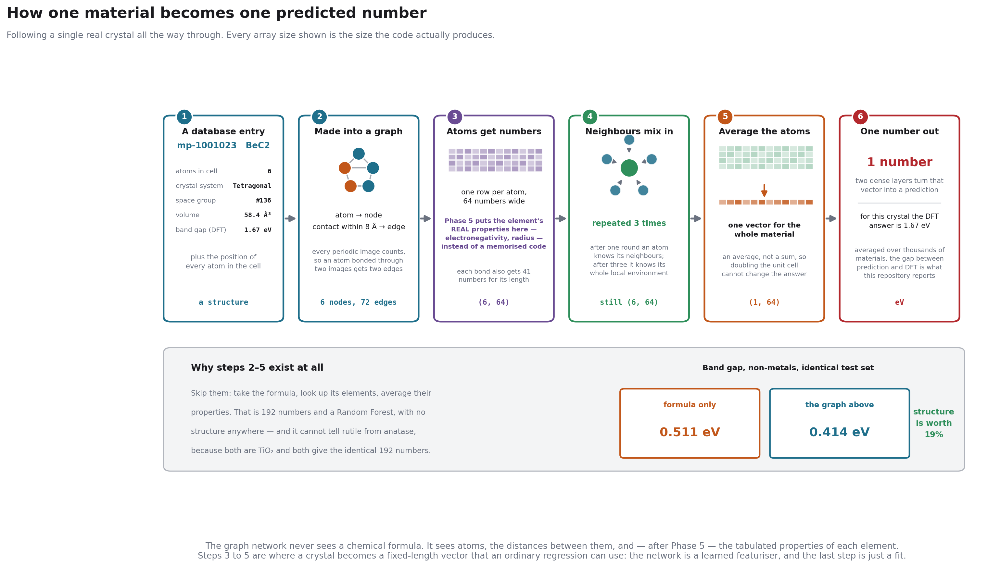

A single real crystal, followed all the way from its database entry to a
predicted number. Every array size shown is the size the code actually produces.

The important thing to notice is **step 5**: whatever the crystal was — 3 atoms or
30 — it ends up as one fixed-length list of 64 numbers. Everything after that is
ordinary regression. A graph network is best understood not as a predictor but as
a **learned featuriser**: its job is to turn an irregular, variable-sized object
into a fixed-length summary, and the actual prediction is the easy part.

### 2. What the network looks like

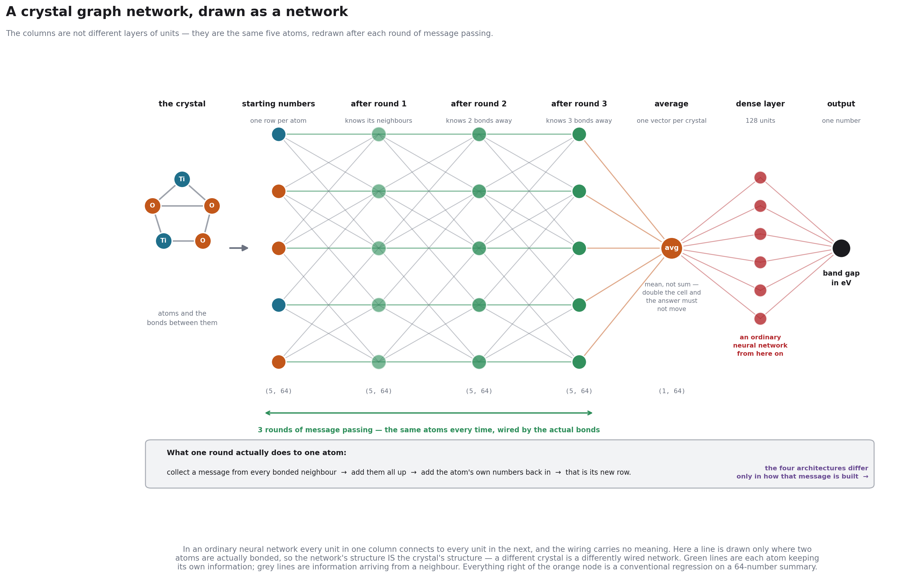

The same crystal, drawn the way neural networks are usually drawn. The columns
are **not** different layers of units — they are *the same five atoms*, redrawn
after each round of message passing.

That is the one idea worth taking away. In an ordinary neural network, every unit
in one column connects to every unit in the next and the wiring means nothing.
Here **a line exists only where two atoms are actually bonded**, so the network's
wiring *is* the crystal's structure. Feed it a different crystal and you get a
differently wired network. This is why the model can tell rutile from anatase and
a formula-based model cannot.

### 3. Where the four architectures differ

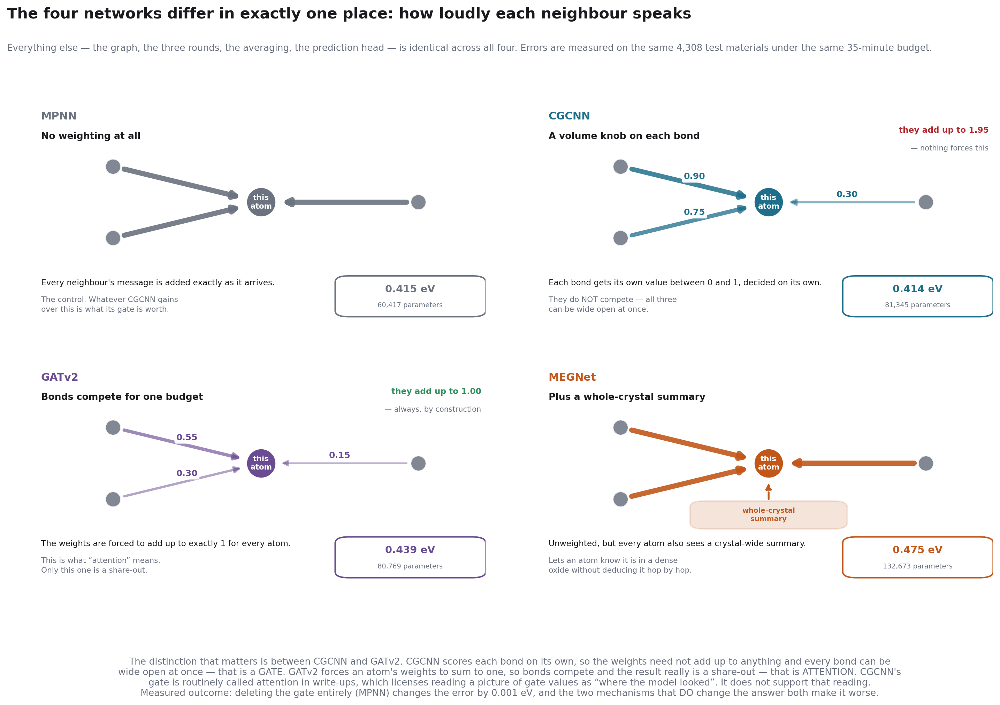

All four networks agree on the recipe in picture 2. They differ in exactly one
place: **how loudly each neighbour gets to speak.**

This is also where a distinction the field is casual about becomes visible.
CGCNN scores each bond on its own, so the weights need not add up to anything and
every bond can be wide open at once — that is a **gate**. GATv2 forces an atom's
weights to sum to one, so bonds compete for a fixed budget — that is
**attention**. CGCNN's gate is routinely called attention in write-ups, which
licenses reading a picture of gate values as "where the model looked". It does
not support that reading, and this repository does not make that claim.

The measured outcome is in [§4](#4-the-most-copied-idea-in-this-field-does-not-measurably-do-anything):
deleting the gate entirely changes the error by 0.001 eV.

---

## First: what every "eV" number on this page means

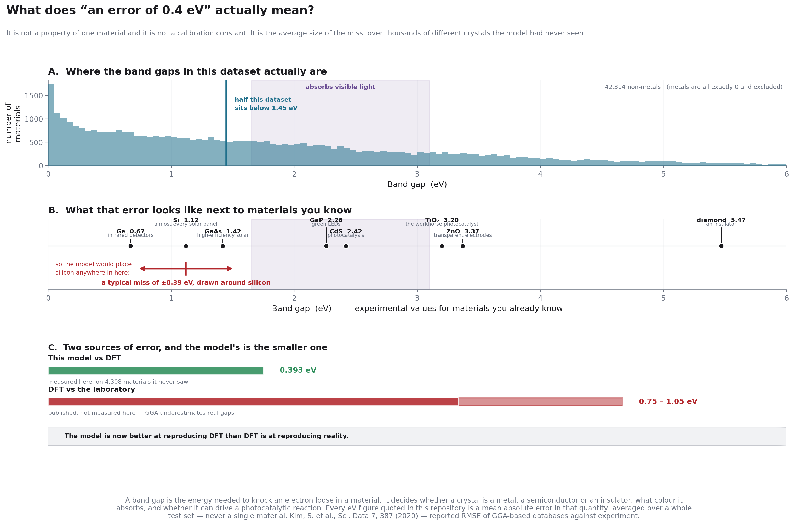

Every headline number in this repository is a number of **electron-volts**, so it
is worth being exact about what that number is — because it is easy to assume it
means something it doesn't.

**It is not one material.** It is not a calibration constant, and it does not
belong to any particular metal or compound. It is a **mean absolute error**: take
thousands of crystals the model has never seen, predict the band gap of each one,
and average how far off it was. "0.393 eV" means *the typical miss, across 4,308
different materials.*

**The property being predicted is the band gap** — the energy needed to knock an
electron loose. It is the single number that decides whether a crystal conducts,
semiconducts or insulates, what colour it absorbs, and whether it can drive a
photocatalytic reaction under sunlight. Silicon is 1.12 eV, TiO₂ is 3.20 eV,
diamond is 5.47 eV.

**Metals are excluded from most of these numbers.** A metal has a band gap of
exactly zero by definition, and **58.9% of this dataset are metals**. Leaving them
in lets a model score well by learning nothing more than "is this a metal" — which
is why the tables say *non-metals*. Across the 42,314 non-metals, the median gap
is **1.45 eV**, so a 0.393 eV error is about **27% of a typical value**.

**And the labels themselves are wrong by more than the model is.** These models
are trained on DFT calculations, so the best they could ever do is reproduce DFT
exactly. DFT is not reality: GGA-family functionals systematically underestimate
real band gaps, and published GGA databases sit **0.75–1.05 eV RMSE away from
laboratory measurements**
([Kim et al., *Sci. Data* **7**, 387, 2020](https://www.nature.com/articles/s41597-020-00723-8)).

> So: this model reproduces DFT to **0.393 eV**, and DFT reproduces the laboratory
> to about **0.9 eV**. If you want an experimental band gap, the calculation you
> are copying is now the larger source of error, not the network. That matters far
> more for using these numbers than any of the model comparisons below.

Formation energy and stability are quoted in **eV per atom** — a different
quantity on a different scale, always labelled as such.

---

## Results so far

Everything below is measured on **all 102,957 crystals**, not a sample, on one
laptop CPU. Reproduce it with the commands in [§7](#7-running-it-yourself).

Unless a table says otherwise, every number is a **mean absolute error in
DFT-computed band gap, in eV, over non-metals only** — see the section above.

### 0. The headline: a graph network wins — until it meets a new element

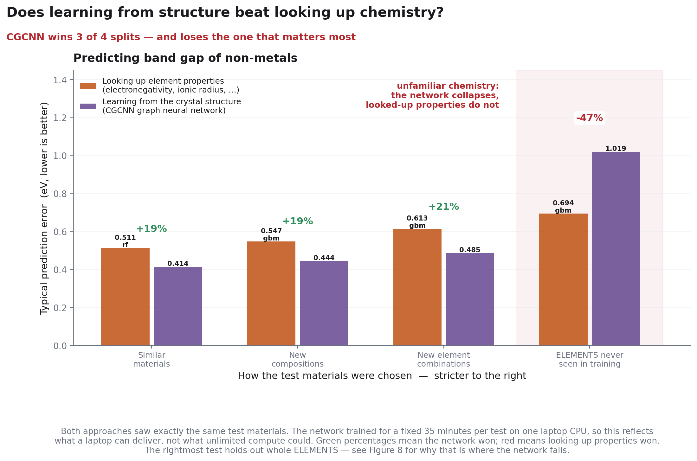

CGCNN, written from scratch and trained under a fixed 35-minute CPU budget,
against the best chemistry-descriptor model on identical test sets. Band gap,
non-metals only:

| Test set | CGCNN | Best descriptor model | |
|---|---|---|---|
| Random split | **0.414 eV** | 0.511 eV | **+19%** |
| A formula it has never seen | **0.444 eV** | 0.547 eV | **+19%** |
| A chemical system it has never seen | **0.485 eV** | 0.613 eV | **+21%** |
| **An element it has never seen** | **1.019 eV** | **0.694 eV** | **−47%** |

Learning from structure beats looking up chemistry by about 20% — consistently,
across three increasingly strict tests. Then it **collapses on the fourth**.

**Why, and it is not subtle.** A GNN learns a numerical fingerprint for each
element from the training data. Meet an element that was never in training and
that fingerprint is meaningless — the model is guessing. A descriptor model looks
up electronegativity and ionic radius, which exist for every element in the
periodic table whether or not you have seen a compound containing it, so it
degrades gracefully instead.

**You can watch it happen.**

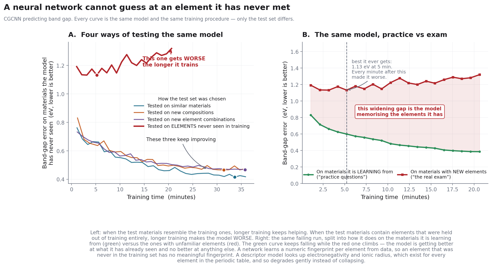

On the element-disjoint test, the model keeps getting better at the materials it
is *learning from* (green, falling) while getting steadily **worse** at the ones
containing unfamiliar elements (red, rising). It is spending its effort
memorising the elements it has. Training longer actively hurts — the best it ever
managed was at 5 minutes, and the remaining 15 minutes made it worse.

The other three tests show the opposite: train longer, do better.

| | Random → unseen element |
|---|---|
| CGCNN | 0.414 → 1.019 eV  (**+146%**) |
| Descriptors | 0.511 → 0.694 eV  (**+36%**) |

**This is the single most useful number in the repository.** It says a published
GNN benchmark score tells you very little about how the model will behave on
chemistry outside its training set.

It also points directly at a fix: give the network the looked-up element
properties *as node features* instead of letting it learn a private code. **That
fix was built and run — see [§5](#5-the-fix-give-the-network-the-periodic-table-and-it-wins-every-test).
It cuts 1.019 eV down to 0.663 eV and improves all four splits**, turning the
−47% loss into a +4% win.

> Three of the four runs stopped on the time budget with validation still
> falling, so those are **lower bounds**. The element-disjoint run stopped on
> early stopping — it had genuinely stopped improving.

### 1. Chemistry alone is a much higher bar than people assume

A random forest on **nothing but looked-up element properties** — electronegativity,
ionic radius, valence electron count — with **no crystal structure at all**:

| Target | Chemistry only | + cheap structure | Trivial floor |
|---|---|---|---|
| **Band gap** | **0.342 eV** | 0.335 eV | 0.744 eV |
| Band gap, non-metals | 0.523 eV | 0.511 eV | 1.155 eV |
| Formation energy | 0.172 eV/atom | **0.121 eV/atom** | 1.018 eV/atom |
| Stability (E above hull) | 0.149 eV/atom | **0.092 eV/atom** | 0.194 eV/atom |

For scale, the published CGCNN paper reports **0.388 eV** on Materials Project
band gap. Composition-only descriptors land at **0.342 eV** here. *That is not a
head-to-head* — different snapshot, different subset, different split — but it
sets the bar a graph network has to clear, and the bar is high.

### 2. Structure helps enormously for energies and barely at all for band gap

Adding cheap structural features (density, volume per atom, space group, packing
fraction) on top of chemistry:

| Target | Improvement from structure |
|---|---|
| Band gap | **+0.6% to +3.9%** |
| Band gap, non-metals | +2.3% to +2.6% |
| Formation energy | **+25.6% to +32.5%** |
| Stability | **+33.3% to +46.2%** |

Chemically this makes sense — formation energy and hull distance are packing and
thermodynamic quantities, while a band gap is electronic and dominated by which
elements are present. For stability, *structure alone beats chemistry alone*
(0.125 vs 0.149 eV/atom). It is the only target where that happens.

### 3. A random split hides model degradation completely

Pooled band-gap error barely moves across splits (0.33–0.43 eV) and is even
*better* on unseen elements. That looks like a model that generalises. It isn't —
59% of the dataset are metals with a gap of exactly zero, and they mask
everything. Restrict to non-metals and the real curve appears:

| Split | Non-metal band gap MAE |
|---|---|
| Random | 0.511 eV |
| New formula | 0.547 eV |
| New chemical system | 0.614 eV |
| **New element** | **0.694 eV**  → **36% worse** |

And **42.6% of a random test set shares a chemical formula with something in
training**. Li₇Mn₂(CoO₄)₃ alone has 221 entries at identical cell size.

### 4. The most-copied idea in this field does not measurably do anything

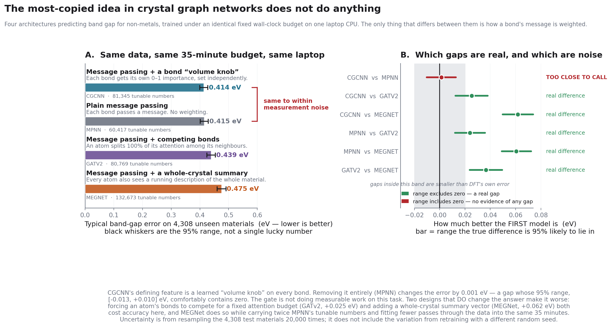

CGCNN's defining feature — the thing the 2018 paper is built around, and the
thing hundreds of follow-up papers inherited — is a learned "volume knob" on
every bond: a number between 0 and 1 that decides how loudly that bond's message
is heard. It sounds obviously useful. Chemically, it is how you would say
*this contact matters more than that one*.

So we removed it. **MPNN is CGCNN with the knob deleted and nothing else
changed** — same inputs, same way messages are combined, same readout, same
35-minute budget, same 4,308 test materials.

| Model | What it adds | Band-gap error | Tunable numbers |
|---|---|---|---|
| **CGCNN** | a per-bond "volume knob" | **0.414 eV** | 81,345 |
| **MPNN** | *nothing* — plain message passing | **0.415 eV** | 60,417 |
| GATv2 | bonds compete for a fixed attention budget | 0.439 eV | 80,769 |
| MEGNet | a running whole-crystal summary | 0.475 eV | 132,673 |

The difference between the top two is **0.001 eV**. Resampling the test set
20,000 times puts the 95% range on that difference at **[−0.013, +0.010] eV** —
comfortably containing zero. For scale, DFT's own disagreement with experiment on
band gap is roughly **1 eV**, a thousand times larger.

**The knob is not doing measurable work**, and it costs 21,000 extra tunable
numbers to not do it.

The two designs that *do* change the answer both make it **worse**. Forcing an
atom's bonds to compete for a fixed 100% attention budget (GATv2) costs 0.025 eV;
adding a whole-crystal summary vector (MEGNet) costs 0.062 eV while carrying more
than twice MPNN's parameters and fitting fewer passes through the data into the
same wall clock.

> **Read this the right way.** This is one target, one dataset, one seed, one
> budget. It does **not** say CGCNN's gate is useless everywhere — it says that on
> 33,687 training crystals predicting band gap, it buys nothing you could measure.
> The uncertainty above comes from resampling *materials*, not from retraining
> with different random seeds, which would widen it further. Both caveats are in
> [LIMITATIONS.md](LIMITATIONS.md).

The useful conclusion for Phase 5 is that **architecture is not the lever here.**
Four different ways of passing messages between atoms land within 0.06 eV of each
other, while the gap between a random split and an unseen-element split is
**0.6 eV** — ten times larger. The problem is what the model knows about
elements, not how it moves information between them.

### 5. The fix: give the network the periodic table, and it wins every test

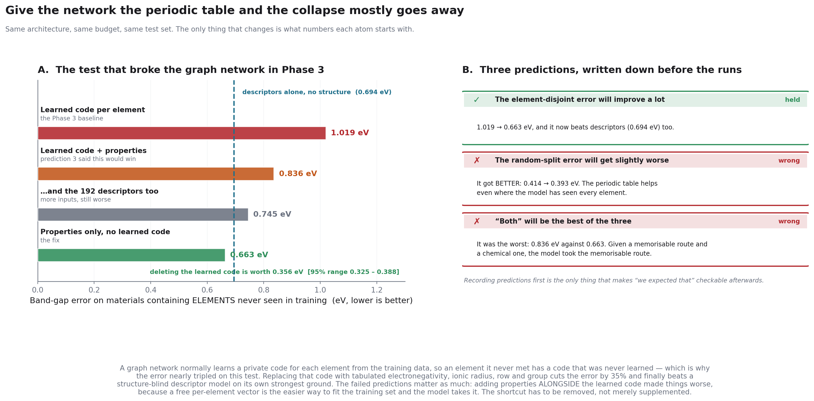

§0 diagnosed the collapse: the network learns a *private code* for each element
from training data, so an element it never met has a code that was never learned.
Phase 5 deleted the learned code and gave each atom its **tabulated properties
instead** — electronegativity, ionic radius, row, group, valence count. Those
exist for every element in the periodic table whether or not you have ever seen a
compound of it.

Same architecture, same 35-minute budget, same test sets. The only change is what
numbers each atom starts with. **All four splits, now complete:**

| Test set | Chemistry only | Graph net, learned codes | **Graph net + periodic table** |
|---|---|---|---|
| Materials like the training set | 0.511 | 0.414 | **0.393** |
| A formula it has never seen | 0.547 | 0.444 | **0.404** |
| An element combination it has never seen | 0.613 | 0.485 | **0.447** |
| **An ELEMENT it has never seen** | 0.694 | *1.019* | **0.663** |

**It improves every single test, and the −47% loss becomes a +4% win.** Paired
bootstrap on the 3,666 unseen-element materials: deleting the learned code is
worth **0.356 eV, 95% range [0.325, 0.388]**, p < 10⁻⁴.

#### Why the learned code was worthless — measured, not asserted

The obvious question is *what was that learned per-element code actually storing?*
`scripts/diagnose_fusion.py` answers it with a test whose answer does not depend
on this repository being right: **do chemically similar elements end up with
similar vectors?** Cl and Br should be close; Cl and Na should not.

| Element table | Alike pairs | Unalike pairs | **Contrast** |
|---|---|---|---|
| Tabulated properties (Phase 5) | +0.814 | −0.227 | **+1.041** |
| Learned codes (Phase 3), trained | +0.054 | −0.033 | **+0.087** |
| *Random numbers, for comparison* | *+0.098* | *−0.016* | *+0.115* |

**The trained element table contains no more chemical structure than random
numbers do.** It is a set of arbitrary per-element labels, not chemistry. That is
the whole story in one row: an arbitrary label for an element you have never seen
carries no information at all, whereas an electronegativity does.

#### Three predictions were written down before the runs. One held.

- ✅ *"The unseen-element error will improve a lot."* 1.019 → 0.663 eV.
- ❌ *"The random-split error will get slightly worse."* It got **better**:
  0.414 → 0.393 eV. I expected 31 fixed properties to be less expressive than 64
  free numbers where the model has seen everything. Given the table above, that
  was backwards — the free numbers never became expressive in the first place.
- ❌ *"'Both' will be the best of the three."* It was the **worst** fusion
  variant, 0.836 eV against 0.663 eV.

**And my explanation for that third failure was also wrong.** I claimed the model
*prefers* the memorisable route. Measured, the tabulated properties carry the
larger share of the between-element signal — the model did not prefer the
shortcut. The corrected account is narrower: a pathway does not have to dominate
to do damage. For a held-out element the learned row was never trained, so
whatever it contributes is noise, and nothing lets the model switch that route off
for exactly the elements where it is meaningless.

**And that correction has now been tested rather than asserted.** Take the trained
`both` model, overwrite only the ten held-out elements' rows with the average
trained row — same weights, no retraining — and re-score:

| | Unseen-element error |
|---|---|
| `both`, as trained | 0.836 eV |
| …untrained rows neutralised | **0.744 eV** |
| `properties`, no learned route at all | 0.663 eV |

**Neutralising those rows recovers 53% of the penalty without touching a single
trained weight.** So the mechanism is real — but it is only half the story. The
remaining 0.081 eV is unexplained. The obvious untested suspect is the 14,720
extra parameters `both` carries, and I have not run that control.

That is three explanations for this one result: two refuted, one confirmed at
about half strength. It is recorded that way rather than trimmed to the version
that worked.

> **What a chemical engineer should take from this.** Structure is worth ~20%
> over chemistry, but only if the network is *also* given the chemistry. A graph
> network left to invent its own element representation learns labels, not
> periodic trends, and falls apart the moment it meets an element outside its
> training set. Handing it the periodic table costs nothing and fixes that.

### 6. So which chemistry did it actually use?

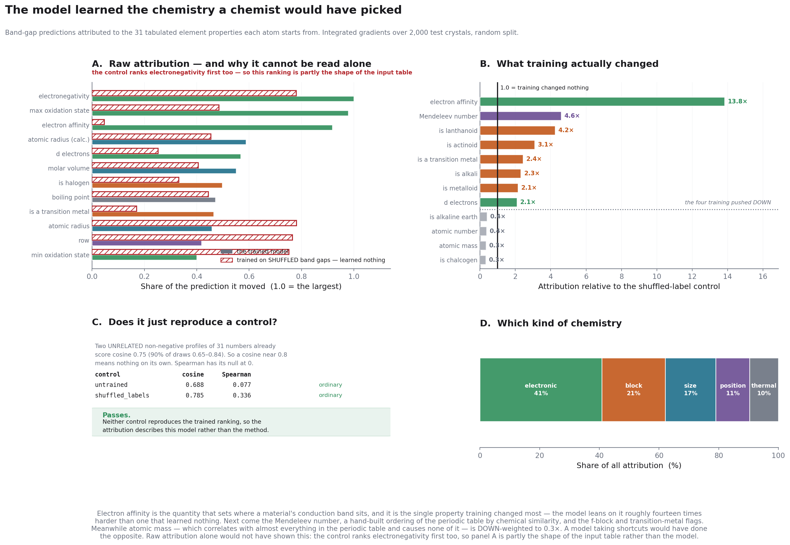

§5 showed the tabulated properties help. It did not say **which** ones — and "the
model uses chemistry" is not a finding until you can name the chemistry.

That question is only askable because of §5. When each atom started from a
learned 64-number code there was nothing to attribute a prediction *to*: the
numbers had no names and, as the diagnostic showed, no chemical structure either.
Now every atom starts from 31 quantities with names and units.

**The naive answer is misleading, and that is the interesting part.** Raw
attribution puts electronegativity first — which looks like a triumph, until you
run the same procedure on a model trained on **shuffled** band gaps and it puts
electronegativity first too. Part of that ranking is the geometry of the property
table, not anything the model learned.

Dividing by the control leaves only what training changed:

| Property | vs. a model that learned nothing |
|---|---|
| **Electron affinity** | **13.8×** |
| Mendeleev number | 4.6× |
| is a lanthanide | 4.2× |
| is an actinide | 3.1× |
| is a transition metal | 2.4× |
| … | |
| atomic number | 0.4× |
| **atomic mass** | **0.3×** |

**Electron affinity is the quantity that sets where a material's conduction band
sits** — it is about as close to the physical cause of a band gap as a
single-element property gets, and it is the one training changed most. Next is
the **Mendeleev number**, a hand-built ordering of the periodic table by chemical
similarity, then the f-block and transition-metal flags.

**And atomic mass was pushed *down* to 0.3×.** Mass correlates with almost
everything in the periodic table and causes none of it. A model taking shortcuts
would have leaned on it. This one did the opposite.

By family: **electronic 41%**, block 21%, size 17%, position 11%, and thermal
last at 10% — melting and boiling point being exactly the proxies a shortcut
would exploit.

> **The controls are the contribution here, not the ranking.** Attribution
> methods produce confident-looking rankings from models that learned nothing at
> all ([Adebayo et al., NeurIPS 2018](https://arxiv.org/abs/1810.03292)). So the
> same procedure was run on an untrained model and on one trained to convergence
> on shuffled labels — which reached R² = −0.04, i.e. it genuinely learned
> nothing. Rank correlation with the trained model: **+0.08** and **+0.34**.
> Neither reproduces it.

**One methodological error worth recording.** The first run reported the shuffled
control at cosine 0.785 and called it "borderline". It is not — two *unrelated*
non-negative profiles of 31 numbers score 0.75 on average. The threshold had been
chosen by intuition on the assumption that unrelated vectors score near zero,
which is true for signed vectors and false for importance profiles. The check now
computes its null by sampling and reports Spearman alongside, whose null really
is zero. **A sanity check whose threshold is guessed is not a sanity check.**

### 7. Two bugs that would have been completely silent

Both were caught by tests that check physics, not code paths, and both are
written up in full below:

- **Periodic images.** At an 8 Å cutoff, a single atom in a 3 Å cell has **80
  neighbours**; the textbook ±1 image search finds **26**. It would have truncated
  the neighbour list of nearly every small cell with no symptom but worse models.
- **DFT functional assignment.** Materials Project returns ~2.2 thermodynamic
  records per material. Taking the first one made the recorded functional depend
  on *network response order*. A fixed preference rule was **refuted by evidence**:
  the summary endpoint agrees with r2SCAN for 14% of TiO₂ entries.

> **Status: Phases 0–5 of 10 built.** Dataset, graphs, leakage-aware splits,
> descriptor baselines, CGCNN from scratch, a controlled four-architecture
> comparison, and descriptor–GNN fusion — all four splits run for each headline
> claim. The question the repository was built to ask now has an answer:
> **structure beats chemistry by ~20%, but only if the network is also handed the
> chemistry.** Left to invent its own element representation it learns arbitrary
> labels — measurably no more chemical structure than random numbers — and falls
> apart on unfamiliar elements. Architecture was not the lever; the input was.
> Phase 6 (interpretability) and Phase 7 (catalysis targets) are next.

---

## Reading this without a machine learning background

Everything above **"Under the hood"** is written for a chemical or materials
engineer. Here is the whole vocabulary you need:

### How to read any number in this repository

Every prediction error is a **mean absolute error in electron-volts** — the typical
size of the model's mistake, averaged over every material in the test set, in the
property's own units. Lower is better. It is never a single material's error and
never a calibration offset; see
[the section above](#first-what-every-ev-number-on-this-page-means) for the full
version, including why 0.4 eV is smaller than DFT's own disagreement with the lab.

Quick scale: silicon's band gap is 1.12 eV, TiO₂'s is 3.20 eV, and the median
non-metal in this dataset is 1.45 eV. So a 0.4 eV error is roughly a quarter of a
typical value — enough to move a material in or out of the visible-light range.

Every result is reported **four times**, once per test set, because a model's
score depends enormously on how you choose what to test it on:

| Test set | The question it answers |
|---|---|
| **Similar materials** | How well does it do on more of the same? *(the usual default — and the most flattering)* |
| **New compositions** | …on a chemical formula it has never seen? |
| **New element combinations** | …on a combination like Li–Mn–Co–O it has never seen? |
| **Elements never seen in training** | …on an element that was held out of training entirely? |

If a paper reports only the first column, treat its number as an upper bound on
what you would get in your own lab.

### The vocabulary, in full

| Term | What it means |
|---|---|
| **Graph** | A bonding diagram written down so a computer can read it. Dots and lines, nothing more exotic. |
| **Node** | One atom. |
| **Edge** | One neighbour contact — two atoms close enough to interact. |
| **Message passing** | Each atom updates its own description using its neighbours', over and over. After three rounds an atom's description reflects its full coordination environment — the same information you use when you say "octahedral Ti". |
| **Descriptor** | A chemical property you already know and can look up: electronegativity, ionic radius, melting point, valence electron count. |
| **Baseline** | A deliberately simple model. If the complicated one can't beat it, the complication wasn't worth it. |
| **Training / test split** | The model learns from one set of materials and is graded on a different set it has never seen. Grading it on what it memorised would tell you nothing. |
| **MAE** | Mean absolute error — the typical size of the model's mistake, in the property's own units. "MAE 0.3 eV" means predictions are off by about 0.3 eV on average. |
| **DFT** | Density functional theory, the quantum calculation that produced most of the numbers here. Calculated, not measured. |
| **GNN** | Graph neural network — a model that learns from a graph. |
| **CGCNN** | Crystal Graph Convolutional Neural Network — the specific GNN built here, from Xie & Grossman (2018). |
| **Overfitting** | The model gets better at the examples it trains on while getting worse at new ones. It is memorising rather than learning. Figure 8 shows it happening. |
| **Validation set** | Materials held aside during training, used to decide when to stop. Not the final test. |

---

## 1. The problem, in one figure

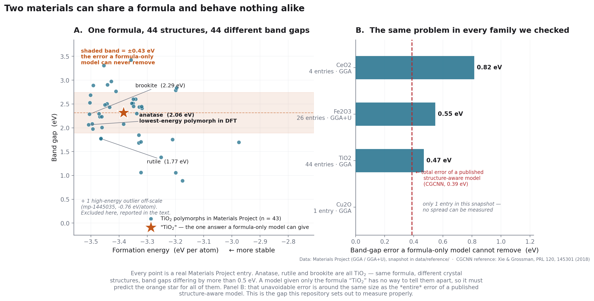

Materials Project holds **44 different TiO₂ crystal structures** computed with the
same DFT settings. Their band gaps run from **0.00 to 3.42 eV**. Same formula,
every one of them. Anatase comes out at 2.06 eV, rutile at 1.77 eV, brookite at
2.29 eV — and those are just the three anyone has named.

A model handed only the formula "TiO₂" has no way to tell these apart. It receives
one input, so it must produce one output, for all 44. The best it can possibly do
is predict the middle of the pack — and the average distance from that middle to
the real values is an error it can **never** remove, no matter how good the model
is or how much data you give it.

**For TiO₂ that unavoidable error is 0.43 eV.** For scale: a well-known
structure-aware model (CGCNN) has a *total* band-gap error of about 0.39 eV across
all of Materials Project. The same pattern shows up in every family we checked —
0.55 eV for Fe₂O₃, 0.82 eV for CeO₂.

**That gap is the reason this repository exists.** How much of it can a
structure-aware model actually recover? Nobody should assume the answer.

---

## 2. What a crystal graph actually is

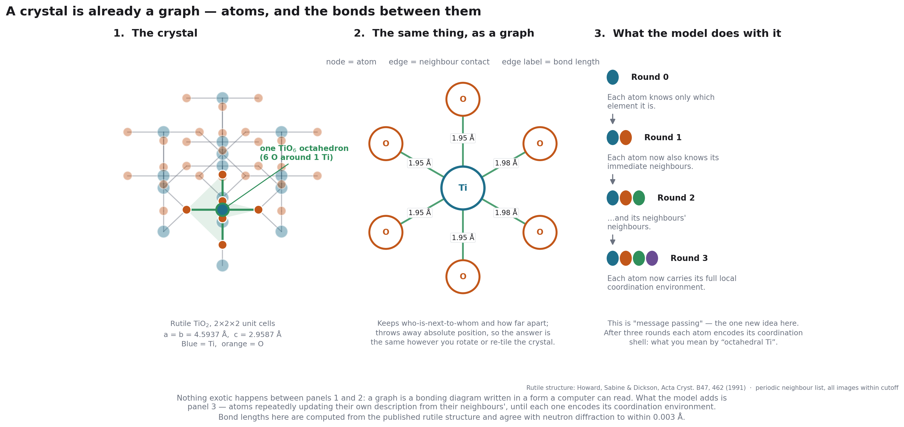

Nothing exotic happens between panels 1 and 2. A graph is a bonding diagram in a
form a computer can read: atoms become nodes, neighbour contacts become edges,
and each edge carries its bond length.

Panel 3 is the only genuinely new idea. Each atom repeatedly rewrites its own
description using its neighbours'. After three rounds it carries its whole local
coordination environment. That is what "message passing" means, and it is why
these models can tell rutile from anatase when a formula cannot.

The structure in that figure is real rutile, built from published
neutron-diffraction parameters. The script recomputes the Ti–O bond lengths and
gets **1.949 Å (×4 equatorial) and 1.980 Å (×2 apical)** against the measured
1.946 and 1.983 Å — asserted on every run, so a typo in a lattice constant fails
loudly instead of quietly producing a wrong picture.

<details>
<summary><b>Two bugs worth reading about, if you ever build one of these</b></summary>

<br>

**Periodic images, part one.** Rutile's unit cell contains only 4 oxygens, yet
every Ti is octahedrally coordinated by 6. Those extra oxygens live in the
*neighbouring repeat* of the crystal. The textbook shortcut — the "minimum image
convention", keeping only the closest copy of each neighbouring atom — silently
returns **Ti CN = 4** and destroys the octahedron. Nothing downstream complains.

**Periodic images, part two.** How many repeats you need depends on the cutoff
*and* the cell. At the 8 Å cutoff the real models use, a single atom in a 3 Å
cubic cell has **80 neighbours within range**; a hard-coded ±1 image search finds
**26**. It would have truncated the neighbour list of every small cell — which is
most of the interesting ones. Worse, the depth must be computed from the cell's
*perpendicular width*, not its vector lengths: for a skewed cell with |b| = 5.0 Å
but a perpendicular width of 2.2 Å, the naive rule gives 2 images where 4 are
needed.

Both are now pinned by tests against brute-force answers.

</details>

---

## 3. Where every number comes from

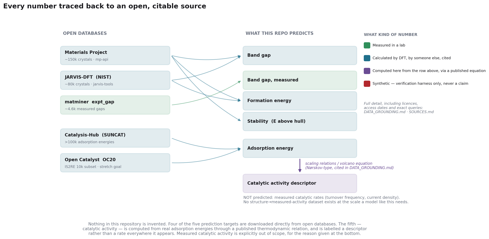

**Nothing in this repository is invented.** Four of the five prediction targets
are downloaded directly from open databases. The fifth — catalytic activity — is
computed from real adsorption energies through a published thermodynamic
equation, and is called a *descriptor* everywhere it appears, never a rate.

| What | Where from | What kind of number |
|---|---|---|
| Band gap, formation energy, stability | Materials Project, JARVIS-DFT | Calculated by DFT |
| Band gap, ~4,600 materials | `matminer` `expt_gap` | **Measured in a lab** |
| Adsorption energy | Catalysis-Hub (SUNCAT), Open Catalyst | Calculated by DFT |
| Catalytic activity descriptor | Derived here from adsorption energies, via scaling relations | A thermodynamic proxy, **not a measured rate** |

Full licences, endpoints, access dates and citations: [`SOURCES.md`](SOURCES.md).
Tiering rules: [`DATA_GROUNDING.md`](DATA_GROUNDING.md).

### What the downloaded data actually looks like

| | |
|---|---|
| Crystals | **102,957** — the complete Materials Project pull under `n_sites ≤ 30`, not a sample |
| Atoms | **1,415,796** |
| Graph edges | **16,919,485** (11.95 per atom, 8 Å cutoff) |
| Elements | **89 of 89** |
| Unique formulas | 70,228, of which **14,976 have more than one polymorph** |
| Build time | 30 min download + 2.5 min graph construction, on one laptop |
| On disk | 27 MB raw + 85 MB graph cache |
| Malformed structures | **0** |

Four facts that shaped every decision after:

- **46% of materials share a formula with another material.** 14,976 formulas have
  multiple polymorphs; SiO₂ alone has 103 entries spanning 0.00–6.47 eV. The
  premise of this repo has real data behind it.
- **59% are metals** — band gap exactly zero. Predicting zero for *everything*
  scores 0.739 eV. Any band-gap result that doesn't separate metals from
  non-metals is flattering itself.
- **29% are computed under more than one DFT functional.** GGA, GGA+U and r2SCAN
  band gaps are different quantities; pooling them produces a plausible-looking
  number that means nothing.
- **70% are `theoretical`** — never experimentally observed.

### What this repository does *not* do

- **It does not predict measured catalytic activity.** No dataset pairs crystal
  structures with measured turnover frequencies at the scale a neural network
  needs. What it produces is a theoretical activity descriptor. That is a
  legitimate screening quantity. It is not a rate you would measure in a reactor.
- **It inherits DFT's errors.** The models learn from DFT numbers, so wherever DFT
  is systematically wrong they will be confidently wrong in the same direction.
- **"Stable" means stable in DFT.** Of 44 TiO₂ polymorphs, DFT puts **anatase** on
  the convex hull, not rutile — while rutile is the ambient-stable phase in reality.
- **It was trained on a laptop.** Reduced scale, and it will not match published
  leaderboard numbers. The gap gets reported, with its reason.

Everything that could go wrong, written down before the results existed:
[`LIMITATIONS.md`](LIMITATIONS.md).

---

## 4. A random split is not a fair test

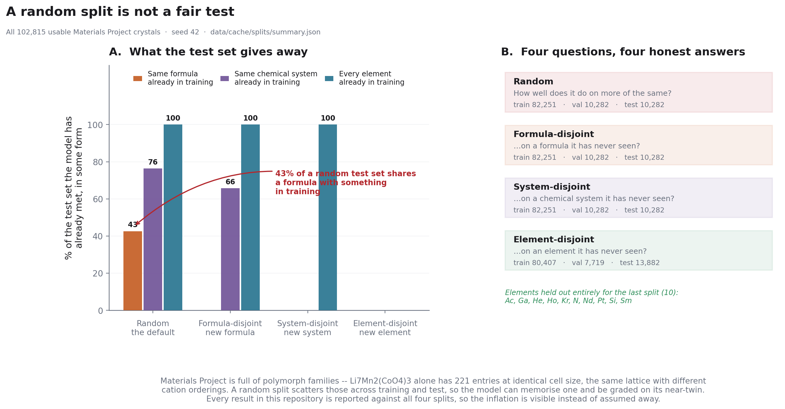

The default in materials ML is a random train/test split. On this database it is
optimistic to the point of being misleading, and the reason is concrete:
**Li₇Mn₂(CoO₄)₃ alone has 221 entries at identical cell size** — the same lattice
with different cation orderings. A random split scatters those across training and
test, so the model memorises one and is graded on its near-twin.

**42.6% of a random test set shares a chemical formula with something in
training.** Under the formula-disjoint split that drops to zero.

So four splits are built, each answering a different honest question, and **every
result in this repository is reported against all four**:

| Split | The question it answers |
|---|---|
| **Random** | How well does it do on more of the same? *(the optimistic default)* |
| **Formula-disjoint** | …on a formula it has never seen? |
| **System-disjoint** | …on a chemical system it has never seen? |
| **Element-disjoint** | …on an **element** it has never seen? *(the extrapolation test)* |

The gap between the first and last is one of the most useful numbers this repo can
produce: it tells you how much to discount a published leaderboard score when
applying a model to chemistry that was not in its training set.

---

## 5. The bar a neural network has to clear

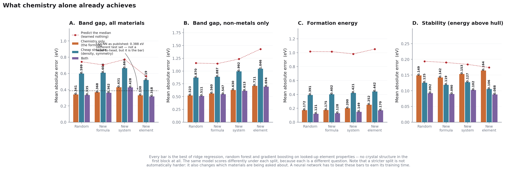

Before building any neural network, we measured what you get from **looking up
element properties in a table** — electronegativity, ionic radius, valence
electron count, melting point — and feeding 192 statistics of them to gradient
boosting. No crystal structure at all. It takes minutes.

Then the same thing plus **cheap structural facts** that need the crystal but not
a graph: density, volume per atom, space group, crystal system, packing fraction.

This matters because it separates two claims that are easy to confuse. "Structure
helps" is interesting. "Density helps" is much less interesting, and is what you
would actually have shown if you never measured the middle column.

The full sweep — 4 models × 3 blocks × 4 targets × 4 splits, 192 fits — takes
**13 minutes** on a 6-core laptop. The headline numbers are in
[§Results](#results-so-far); the complete table is `results/baselines.json`.

**What this means for Phase 3.** A graph network now has a specific, measured job
rather than a vague one:

- On **band gap**, it has to beat **0.342 eV from chemistry alone**, and it cannot
  lean on density or symmetry to do it — those are worth under 4%. Whatever it
  gains has to come from message passing seeing coordination environments.
- On **formation energy and stability**, cheap structure already buys 26–46%, so
  the interesting question is not *whether* structure helps but whether a graph
  beats a handful of scalars that take milliseconds to compute.
- The honest scoreboard is the **non-metal band gap under the element-disjoint
  split**: 0.694 eV. That is the number that reflects what happens when a model
  meets chemistry it was never trained on.

> If the figure above is labelled PROVISIONAL, it was produced from a reduced
> training set as a pipeline check. Run `python scripts/run_baselines.py` without
> `--subsample` for the real numbers.

---

## 6. What is built, and what is not

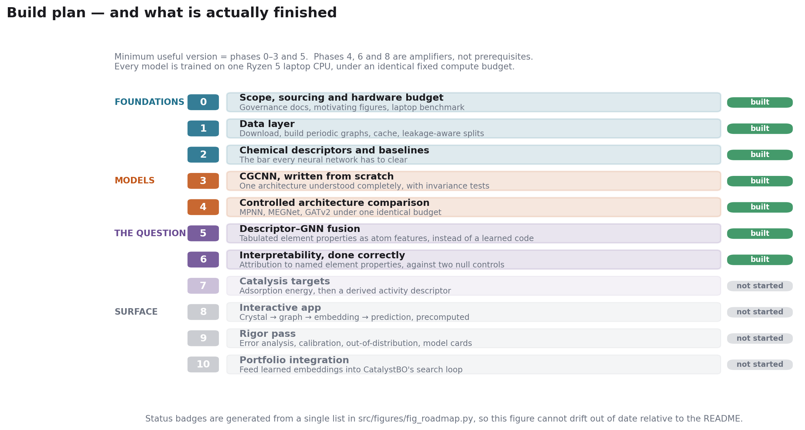

The interesting phase is **5**. A neural network learns representations from
structure; a chemist already has decades of intuition encoded as descriptors. Do
they combine? Four fusion strategies get ablated, and the headline figure will be
a data-efficiency curve: **below some training-set size, known chemistry beats
learned structure.** Where that crossover sits is a practical answer to "which
should I use?" for anyone with a few hundred measurements rather than a few
hundred thousand — the normal situation in a catalysis lab.

Be warned the answer may be unflattering to the neural networks. On several
standard benchmarks, plain composition descriptors with gradient boosting are
competitive with structural GNNs. If that reproduces here, it gets reported.

---

## 7. Running it yourself

Figures 1–4 need only three packages:

```bash
git clone https://github.com/teja2792/CatGNN
cd CatGNN
pip install "numpy>=1.24" "pandas>=2.0" "matplotlib>=3.7" "pytest>=7.4"

python scripts/benchmark_hardware.py    # measure YOUR machine, writes COMPUTE_BUDGET.md
python scripts/make_figures.py --only 1 --only 2 --only 3 --only 4
pytest -q                               # 138 correctness tests
```

To rebuild the dataset and results from scratch (~35 minutes, needs a free
[Materials Project API key](https://next-gen.materialsproject.org/api)):

```bash
pip install -r requirements.txt
setx MP_API_KEY "your_key"          # PowerShell; open a NEW terminal after

python scripts/fetch_mp.py --probe   # 10 s: verify key, network, response shape
python scripts/fetch_mp.py           # ~30 min: 102,958 crystals, ~27 MB
python scripts/inspect_mp.py         # look at the data before modelling it
python scripts/build_graphs.py       # ~3 min: 16.9M edges, ~85 MB
python scripts/build_graphs.py --verify
python scripts/make_splits.py        # four splits + leakage report
python scripts/run_baselines.py      # the bar the GNNs have to clear

pip install torch --index-url https://download.pytorch.org/whl/cpu
python scripts/train_cgcnn.py --selftest          # 1 min: verify the layer
python scripts/train_cgcnn.py --split random --nonmetals    # 35 min each
python scripts/train_cgcnn.py --split formula --nonmetals
python scripts/train_cgcnn.py --split chemsys --nonmetals
python scripts/train_cgcnn.py --split element --nonmetals

python scripts/train_arch.py --selftest                      # 1 min: all four models
python scripts/train_arch.py --arch mpnn   --split random --nonmetals   # 35 min each
python scripts/train_arch.py --arch megnet --split random --nonmetals
python scripts/train_arch.py --arch gatv2  --split random --nonmetals
python scripts/compare_architectures.py    # seconds: is any gap bigger than the noise?

python scripts/train_fusion.py --selftest                        # 1 min
python scripts/train_fusion.py --atoms properties --split element --nonmetals
python scripts/train_fusion.py --atoms both       --split element --nonmetals
python scripts/train_fusion.py --atoms properties --split random  --nonmetals
python scripts/train_fusion.py --atoms both --composition --split element --nonmetals
python scripts/compare_architectures.py --group fusion    # is the gap bigger than the noise?
python scripts/diagnose_fusion.py                         # why did 'both' lose?

python scripts/explain.py --selftest                      # checks the IG maths
python scripts/train_fusion.py --atoms properties --split random --nonmetals --shuffle-labels
python scripts/explain.py --split random                  # which chemistry did it use?

python scripts/make_figures.py       # rebuild every figure from source data
```

`train_arch.py --selftest` is worth the minute. It checks all four models against
the physical facts they must respect — renaming the atoms must not change the
answer, doubling the unit cell must not change the answer, and batching two
crystals together must give the same answers as running them separately — plus
GATv2's attention weights against an independently written NumPy implementation.
A model that violates any of these still trains happily and still reports a
number; the number just means nothing.

No figure here is hand-drawn or hand-edited — each is generated from the data in
`data/reference/` or from published crystal structures, and CI fails if a
committed figure stops matching its script.

`benchmark_hardware.py` exists because quoting somebody else's GPU timings would
be useless. It times graph construction and message passing on *your* CPU and
writes a dataset-size budget to [`COMPUTE_BUDGET.md`](COMPUTE_BUDGET.md).

---

## Under the hood

> Everything below assumes a machine learning background. Nothing above it does.

### The experiment

| | |
|---|---|
| **Question** | Does structure-aware message passing beat composition descriptors, and does fusing them help? |
| **Dataset** | Materials Project, 102,957 crystals, `n_sites ≤ 30`, complete pull (not a sample) |
| **Targets** | Band gap (pooled and non-metals), formation energy, energy above hull; later adsorption energy |
| **Graphs** | 8 Å cutoff, ≤12 neighbours, periodic, 1.42M nodes / 16.9M edges |
| **Descriptors** | 192 composition features (Magpie-style over 31 element properties) + 13 cheap structural |
| **Baselines** | Median / Ridge / Random Forest / HistGradientBoosting |
| **Architectures** | CGCNN, MPNN, MEGNet, GATv2 — all four built from scratch and run (Phase 4). ALIGNN deliberately excluded |
| **Splits** | Random, formula-disjoint, system-disjoint, element-disjoint |
| **Protocol** | Identical 35-min wall-clock budget per model; **one seed each so far**, uncertainty from bootstrapping the test set |
| **Hardware** | Ryzen 5 laptop, CPU only |

Each architecture is present to test one thing, not for completeness: MPNN asks
whether CGCNN's gate earns its keep (answer: no — see §4 of the results); MEGNet
asks whether an explicit global state helps, and is the natural injection point
for a descriptor vector in Phase 5; GATv2 provides genuine attention, so Phase 6's
attention maps come from a model that actually has some.

**ALIGNN is deliberately excluded.** Its line-graph convolution — which adds bond
*angles* — costs several times CGCNN's per epoch. Under a shared wall-clock budget
it would report "ALIGNN is worse" when the honest statement is "ALIGNN saw a third
as many passes through the data". Including it would have produced a number that
looks like an architecture result and is really a clock result. Bond angles remain
an open question here, not a settled one.

### On "attention"

CGCNN and MEGNet have **no attention mechanism.** CGCNN uses a sigmoid *gate* in
its convolution — `σ(zW_f + b_f) ⊙ g(zW_s + b_s)` — with no softmax over neighbours
and no query/key. Every bond is scored independently in (0,1), so all of an atom's
bonds can be wide open at once. MEGNet uses a global state vector. Both are
routinely mislabelled as attention.

The distinction is not pedantry: only a softmax **across** an atom's neighbours
produces weights that sum to one, and only weights that sum to one can honestly be
read as "the model looked *here* rather than *there*". This repo asserts that
property in a test rather than assuming it, and checks the PyTorch implementation
against an independent NumPy one (they agree exactly).

Where this repo shows attention maps they come from GATv2, which actually has
attention. For the others it shows gate activations and integrated-gradient
attributions, and labels them as such.

### Reproducibility choices

- **Element properties are committed**, not read from pymatgen at feature time
  (`data/reference/element_properties.json`, regenerable via
  `scripts/make_element_table.py`). A library upgrade must not silently change the
  features underneath a comparison.
- **Graph edges store raw distances**; the Gaussian basis expansion happens in the
  model. Caching 41 floats per edge would turn an 85 MB cache into ~6 GB and would
  freeze a modelling choice into the data.
- **Missing element properties are imputed once, visibly** (column median, in
  `property_matrix()`), rather than propagating NaN through every statistic.
- **Every download writes a manifest** with query, filters, date, row count,
  sha256 and a one-way fingerprint of the API key. The key never touches a file.

### Where this sits in the current landscape

CGCNN (2018), MEGNet (2019) and GATv2 (2022) are here because they are the
clearest crystal GNNs to implement and understand — not because they are current.
The field has moved to equivariant architectures (NequIP, MACE, SevenNet) and
universal interatomic potentials (M3GNet, CHGNet, MatterSim), and by 2025–26 the
Matbench leaderboards are led by foundation-model approaches. Those assume GPU
compute this project deliberately does not. Nothing here is a statement about what
the best current method can do.

---

## Related repositories

Part of a portfolio applying ML to catalysis and materials research. CatGNN is the
**representation** layer: it learns a numerical fingerprint of a material that the
others can use.

| Repo | What it does | How it connects |
|---|---|---|
| [`MPExplorer`](https://github.com/teja2792/MPExplorer) | Live Materials Project explorer; documents three DFT failure modes | Supplies the data layer, and the snapshot behind Figure 1 |
| [`CatalystBO`](https://github.com/teja2792/CatalystBO) | Bayesian optimisation — decides which catalyst to make next | Phase 10: learned embeddings replace hand-built search-space features |
| [`ExplainableCatML`](https://github.com/teja2792/ExplainableCatML) | Do different explanation methods agree? | Phase 6 extends that question from tabular models to graphs |
| [`SpectraHub`](https://github.com/teja2792/SpectraHub) | XAS spectra → oxidation state, coordination number, bond length | Those become chemical descriptors in Phase 2 |
| [`CatalystML`](https://github.com/teja2792/CatalystML) | Property prediction from tabular features | The non-graph point of comparison |
| [`MieCatalystML`](https://github.com/teja2792/MieCatalystML) | Validated Mie scattering physics engine for Cu₂O | Downstream consumer of predicted optical properties |

## Licence

MIT (see [`LICENSE`](LICENSE)). Each dataset carries its own licence — see
[`SOURCES.md`](SOURCES.md).
